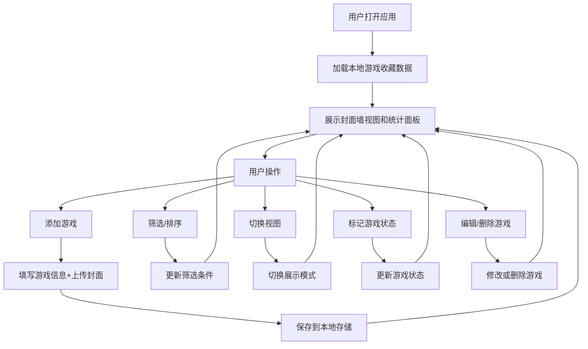

## 1. 产品概述

复古游戏收藏管理工具是一款面向复古游戏爱好者的本地收藏整理应用，帮助用户管理和展示自己的ROM游戏收藏，提供美观的游戏卡带货架视觉体验。

- **核心价值**：为复古游戏玩家提供专属的收藏管理体验，模拟实体游戏卡带货架的视觉呈现
- **目标用户**：复古游戏收藏家、模拟器玩家、怀旧游戏爱好者
- **主要功能**：游戏卡片管理、多视图浏览、筛选排序、状态标记、数据统计

## 2. 核心功能

### 2.1 用户角色
| 角色 | 注册方式 | 核心权限 |
|------|----------|----------|
| 普通用户 | 无需注册，本地使用 | 游戏收藏的增删改查、筛选排序、状态标记、数据统计 |

### 2.2 功能模块
1. **游戏收藏主页**：游戏卡带封面墙视图、筛选工具栏、统计面板
2. **游戏卡片管理**：添加/编辑/删除游戏、上传封面图、填写游戏信息
3. **多视图切换**：封面墙（卡带货架）、列表视图、时间轴视图
4. **筛选排序**：按平台、类型、年份筛选，按名称、年份、平台排序
5. **游戏状态标记**：已通关、正在玩、想玩三种状态
6. **统计面板**：总游戏数、各平台占比、最老/最新游戏

### 2.3 页面详情
| 页面名称 | 模块名称 | 功能描述 |
|----------|----------|----------|
| 主页面 | 顶部导航栏 | 应用标题、添加游戏按钮、视图切换、搜索框 |
| 主页面 | 统计面板 | 总游戏数、平台占比图表、最老最新游戏展示 |
| 主页面 | 筛选工具栏 | 平台筛选、类型筛选、年份筛选、排序选项 |
| 主页面 | 游戏展示区 | 封面墙/列表/时间轴三种视图切换展示 |
| 添加/编辑弹窗 | 游戏信息表单 | 名称、平台、发行年份、厂商、类型、封面上传 |
| 游戏卡片 | 状态标记 | 点击标记已通关/正在玩/想玩 |

## 3. 核心流程

## 4. 用户界面设计

### 4.1 设计风格
- **设计主题**：复古CRT显示器+游戏卡带货架风格，深色怀旧主题
- **主色调**：深炭灰背景 `#1a1a2e`，霓虹蓝点缀 `#00d9ff`，霓虹粉 `#ff006e`，琥珀黄 `#ffbe0b`
- **字体**：标题使用像素风格字体 "Press Start 2P"，正文使用 "VT323" 复古终端字体
- **按钮风格**：复古像素边框，悬停时有CRT扫描线动画效果
- **布局**：顶部导航+侧边统计+主内容区的三栏布局，游戏卡片采用实体卡带样式设计
- **图标风格**：像素风图标，使用 emoji 配合像素边框

### 4.2 页面设计概述
| 页面名称 | 模块名称 | UI 元素 |
|----------|----------|----------|
| 主页面 | 顶部导航栏 | CRT扫描线背景、像素字体标题、霓虹发光按钮、搜索框带像素边框 |
| 主页面 | 统计面板 | 半透明深色卡片、霓虹边框、平台占比饼图、数据发光效果 |
| 主页面 | 筛选工具栏 | 下拉选择器带像素边框、标签式筛选按钮、激活态霓虹发光 |
| 主页面 | 封面墙视图 | 游戏卡带立体效果、阴影、悬停上浮动画、货架木纹背景 |
| 主页面 | 列表视图 | 表格布局、斑马纹、行悬停高亮 |
| 主页面 | 时间轴视图 | 垂直时间线、年份节点、游戏卡片沿时间线分布 |
| 游戏卡片 | 卡带样式 | 顶部标签（平台颜色）、封面图、像素边框、状态角标 |
| 弹窗 | 表单 | 深色半透明背景、像素边框输入框、文件上传区域 |

### 4.3 响应式
- **桌面优先**，适配 1280px 及以上宽度
- **平板适配**：统计面板移至顶部，游戏网格自适应列数
- **移动端**：单列布局，筛选条件折叠为抽屉菜单
- **触摸优化**：增大点击区域，长按触发编辑菜单

### 4.4 动效设计
- 页面加载：游戏卡片依次淡入上浮（stagger 动画）
- 悬停效果：卡片上浮 8px + 霓虹阴影增强
- 视图切换：平滑过渡动画，卡片重排有淡入淡出
- 状态标记：状态角标有脉冲发光效果
- CRT效果：全局轻微扫描线覆盖，屏幕角落暗角
