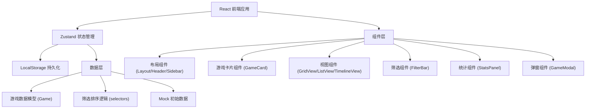
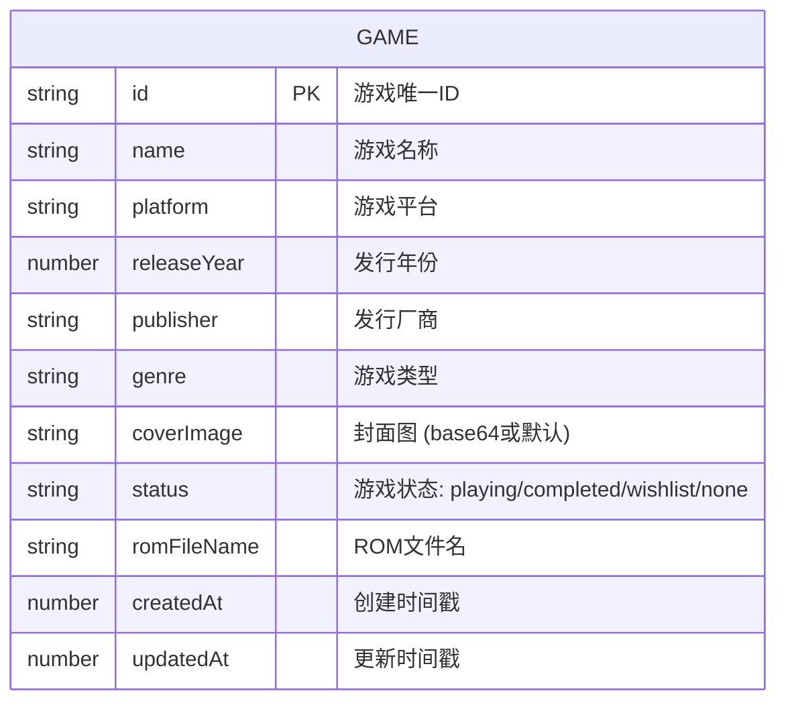

## 1. 架构设计



## 2. 技术描述

- **前端框架**: React@18 + TypeScript + Vite
- **状态管理**: Zustand
- **样式方案**: TailwindCSS@3 + CSS 自定义属性
- **图标库**: lucide-react
- **数据持久化**: LocalStorage
- **初始化工具**: vite-init

## 3. 路由定义

| 路由 | 用途 |
|------|------|
| / | 主页面 - 游戏收藏展示和管理 |

## 4. 数据模型

### 4.1 数据模型定义



### 4.2 TypeScript 类型定义

```typescript
type GameStatus = 'none' | 'playing' | 'completed' | 'wishlist';
type ViewMode = 'grid' | 'list' | 'timeline';
type SortField = 'name' | 'releaseYear' | 'platform' | 'createdAt';
type SortOrder = 'asc' | 'desc';

interface Game {
  id: string;
  name: string;
  platform: string;
  releaseYear: number;
  publisher: string;
  genre: string;
  coverImage: string;
  status: GameStatus;
  romFileName: string;
  createdAt: number;
  updatedAt: number;
}

interface FilterState {
  platform: string | null;
  genre: string | null;
  year: number | null;
  searchQuery: string;
  status: GameStatus | null;
}

interface SortState {
  field: SortField;
  order: SortOrder;
}

interface GameStore {
  games: Game[];
  filters: FilterState;
  sort: SortState;
  viewMode: ViewMode;
  selectedGame: Game | null;
  isModalOpen: boolean;
  
  // Actions
  addGame: (game: Omit<Game, 'id' | 'createdAt' | 'updatedAt'>) => void;
  updateGame: (id: string, updates: Partial<Game>) => void;
  deleteGame: (id: string) => void;
  setGameStatus: (id: string, status: GameStatus) => void;
  setFilters: (filters: Partial<FilterState>) => void;
  setSort: (sort: Partial<SortState>) => void;
  setViewMode: (mode: ViewMode) => void;
  openModal: (game?: Game) => void;
  closeModal: () => void;
  
  // Selectors
  filteredGames: Game[];
  stats: {
    total: number;
    byPlatform: Record<string, number>;
    byStatus: Record<GameStatus, number>;
    oldestGame: Game | null;
    newestGame: Game | null;
  };
}
```

### 4.3 常量定义

```typescript
const PLATFORMS = [
  'NES', 'SNES', 'N64', 'GameCube', 'Wii',
  'PlayStation', 'PlayStation 2', 'PSP',
  'Genesis', 'Saturn', 'Dreamcast',
  'Game Boy', 'Game Boy Advance', 'Nintendo DS',
  'Arcade', 'PC', 'Other'
];

const GENRES = [
  '动作', '冒险', '角色扮演', '策略', '射击',
  '格斗', '竞速', '体育', '益智', '模拟', '其他'
];

const PLATFORM_COLORS: Record<string, string> = {
  'NES': '#c41e3a',
  'SNES': '#5c4033',
  'N64': '#4a2c7a',
  'GameCube': '#7a00ff',
  'Wii': '#ffffff',
  'PlayStation': '#003087',
  'PlayStation 2': '#003087',
  'PSP': '#003087',
  'Genesis': '#000000',
  'Saturn': '#1a1a1a',
  'Dreamcast': '#ff6600',
  'Game Boy': '#c0c0c0',
  'Game Boy Advance': '#7d7d7d',
  'Nintendo DS': '#7d7d7d',
  'Arcade': '#ff006e',
  'PC': '#00d9ff',
  'Other': '#666666'
};

const STATUS_LABELS: Record<GameStatus, string> = {
  none: '未标记',
  playing: '正在玩',
  completed: '已通关',
  wishlist: '想玩'
};
```

## 5. 项目结构

```
src/
├── components/
│   ├── Layout/
│   │   ├── Header.tsx
│   │   ├── Sidebar.tsx
│   │   └── StatsPanel.tsx
│   ├── GameCard/
│   │   ├── GameCardGrid.tsx
│   │   ├── GameCardList.tsx
│   │   └── GameCardTimeline.tsx
│   ├── FilterBar.tsx
│   ├── GameModal.tsx
│   └── ViewToggle.tsx
├── store/
│   └── useGameStore.ts
├── types/
│   └── game.ts
├── utils/
│   ├── mockData.ts
│   └── storage.ts
├── App.tsx
├── main.tsx
└── index.css
```

## 6. 主要组件说明

### 6.1 Header 组件
- 应用标题（像素字体）
- 搜索框
- 视图切换按钮（网格/列表/时间轴）
- 添加游戏按钮

### 6.2 StatsPanel 组件
- 总游戏数统计
- 各平台占比饼图（使用 SVG 绘制）
- 最老/最新游戏展示

### 6.3 FilterBar 组件
- 平台筛选下拉
- 类型筛选下拉
- 年份筛选下拉
- 状态筛选
- 排序选项

### 6.4 GameCardGrid 组件（封面墙）
- 游戏卡带样式卡片
- 立体阴影效果
- 封面图展示
- 状态角标
- 货架背景

### 6.5 GameCardList 组件
- 表格行布局
- 缩略图 + 详细信息
- 快速操作按钮

### 6.6 GameCardTimeline 组件
- 垂直时间轴
- 按年份分组
- 游戏卡片沿时间线排列

### 6.7 GameModal 组件
- 游戏信息表单
- 封面图上传（base64 存储）
- 保存/取消按钮
